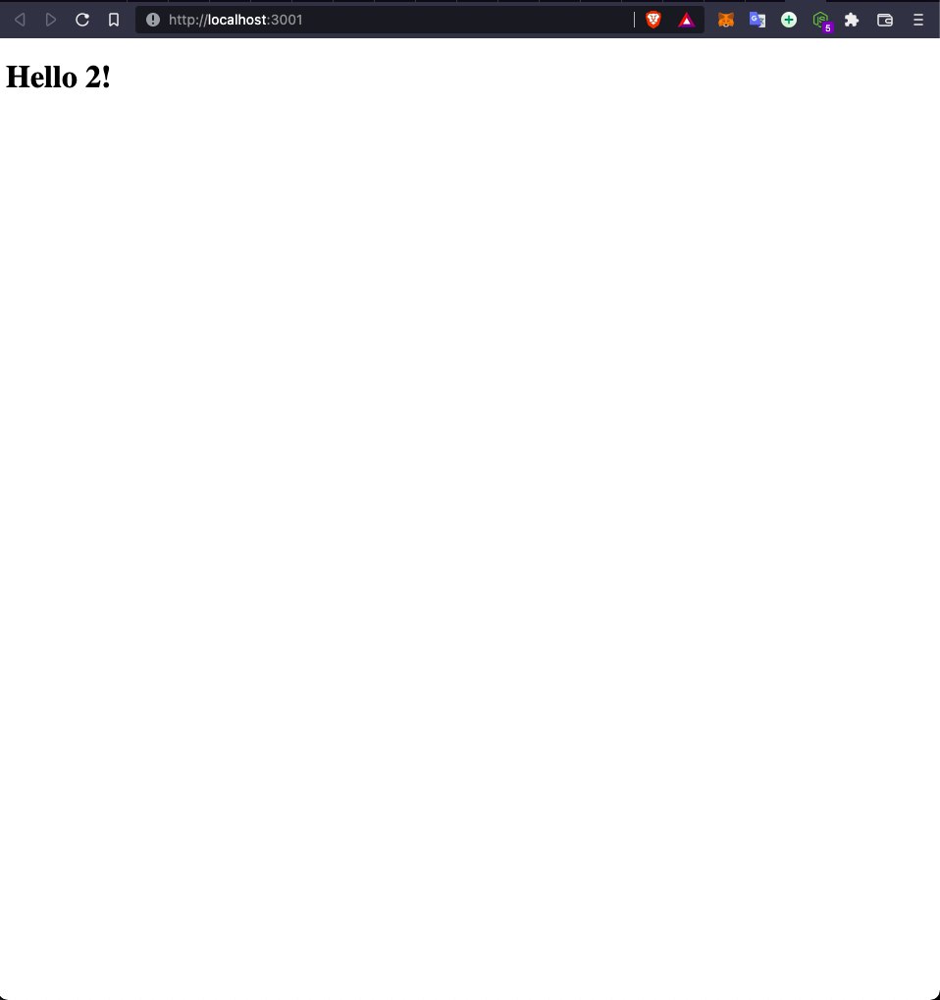

# Set up a "Hello world" project with two apps


> App frontend



## Link to BackEnd PR

[HERE](https://github.com/mmatongo/hello-rails-back-end/pull/4)

## Built With

- React & Redux

## Getting Started

To get a local copy up and running follow these simple example steps.

### Prerequisites

- NodeJS - [v16.x](https://nodejs.org/en/)
- NPM

### Setup

```bash
git clone https://github.com/mmatongo/hello-rails-front-end.git
cd hello-rails-front-end
```

### Install

```bash
yarn
```

### Usage

```bash
npm run start
```

## Author

👤 **Daniel M. Matongo**

- GitHub: [@mmmatongo](https://github.com/mmatongo)
- LinkedIn: [LinkedIn](https://www.linkedin.com/in/mmatongo/)

## 🤝 Contributing

Contributions, issues, and feature requests are welcome!

Feel free to check the [issues page](../../issues/).

## Show your support

Give a ⭐️ if you like this project!

## Acknowledgments

- Microverse

## 📝 License

This project is [MIT](./LICENSE.md) licensed.
